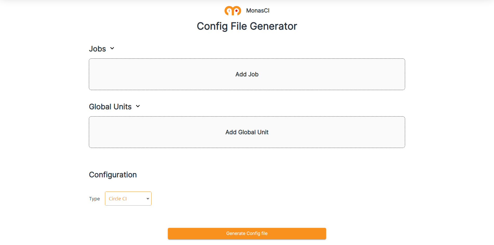

# MonasCI

## Description

MonasCI is a tool that aims to simplify the process of creating and managing CI/CD pipelines. It uses a model-driven engineering approach to generate CI/CD pipeline configurations for multiple CI/CD platforms namely GitLab CI and CircleCI at the current phase.

## Demo Environment

A demonstration environment of MonasCI can be found [here](https://frontend-service-monasci-assifar-karim.cloud.okteto.net/).

## Features

* Generates CI/CD pipeline configurations in YAML format for multiple CI/CD platforms.
* Provides a unified approach to creating and managing CI/CD pipelines across multiple projects and platforms.
* Uses a model-driven engineering approach to generate pipeline configurations, making it easy to understand and maintain.
* Allows you to easily switch between CI/CD platforms without having to rewrite your pipeline configurations.
* Provides a streamlined easy to use interface to create the CI/CD pipelines.

## How To use?

You can either run it locally using docker or use the demonstration environment that we mentioned [here](#demo-environment)

When in MonasCI, to create your first pipeline follow these steps:
1. Create a Job that contains the tasks that you want it to execute and add environment variables if it needs some.
2. Create a Global Unit and add the job you created to it.
3. Select the CI platform you wish to use.
4. Generate your config file and enjoy ! 

## Tech Stack
- **Client Side**: *ReactJS*
- **Server Side**: *Spring Boot* | *Nginx*
- **Model Driven Engineering Side**: *Eclipse Epsilon*
- **Deployment Tools**: *Docker* | *Kubernetes*
- **CI/CD**: *Circle CI*

## Contributors
- [Karim Assifar](https://github.com/Assifar-Karim)
- [Hamza Ben Yazid](https://github.com/HamzaBenyazid)
- [Khalil Charkaoui](https://github.com/khalil99-68)
- [Ibrahim Mestadi](https://github.com/ibrahim-mestadi)
- [Ismail Mosleh](https://github.com/mosle77)

<pre align="center">
MONAS CI | MONASCI TEAM 2023

</pre>